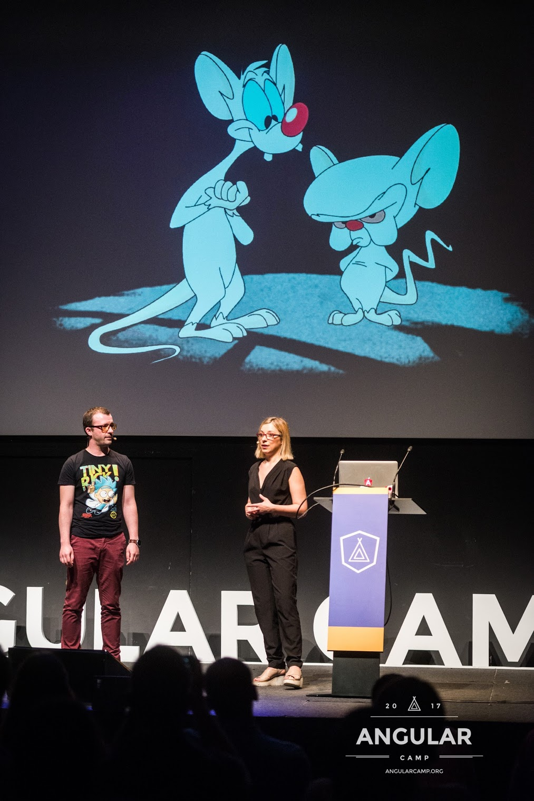

Artur Daschevici Full Stack Engineer @NearForm, Passionate about all things tech related, with wide area of expertise ranging from backend, DevOps, Front End, working with NodeJS, React, React Native and well versed with Python

Find me on:

- [Twitter](https://twitter.com/_arturdas)

- [GitHub](https://github.com/adaschevici)

- [LinkedIn](https://www.linkedin.com/in/artur-daschevici-b5404815/)

Simona Cotin, Developer Advocate @ Microsoft
Simona Cotin is a web developer with a passion for teaching. She spends most of her time tinkering with JavaScript in the cloud and sharing her experience with other developers at community events like meetups and conferences or online. As a Cloud Developer Advocate, Simona engages with the web community to help create a great developer experience with Azure. She loves shipping code to production and has built network data analytics platforms using Angular, Typescript, React, and Node.

Find me on:

- [Twitter](https://twitter.com/simona_cotin)

- [GitHub](https://github.com/simonaco)

- [LinkedIn](https://www.linkedin.com/in/simona-cotin-2ba8747/)

---

Thanks [Brian Holt](https://twitter.com/holtbt) for the wonderful course theme! Built with Gatsby - clone it, fork it, star it! [https://github.com/btholt/gatsby-course-starter](https://github.com/btholt/gatsby-course-starter)